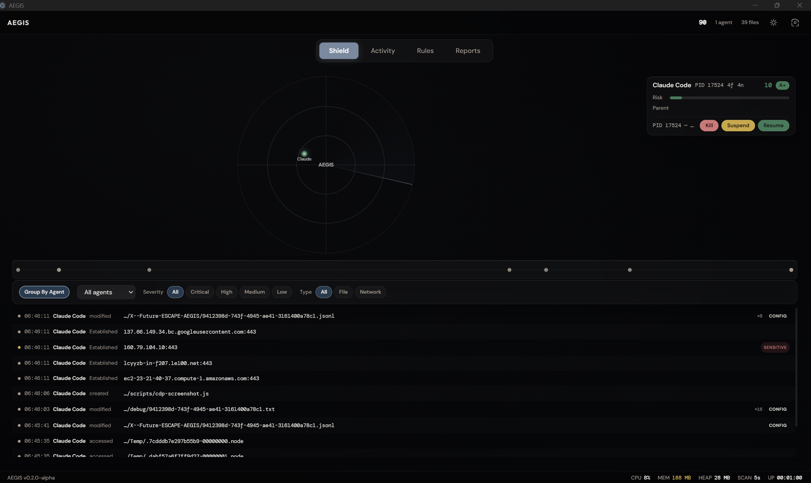

# AEGIS

[](LICENSE)
[]()
[](https://electronjs.org)
[]()
[](https://github.com/antropos17/Aegis/releases/latest)

**Independent AI Oversight Layer — monitors what AI agents do on your computer.**



## Why AEGIS?

AI agents now have deep access to your machine — reading files, scanning codebases, executing commands, and making outbound network connections. Every existing AI security tool is enterprise B2B and monitors what humans send *to* AI. None of them monitor what AI agents do *on local machines*.

AEGIS is an independent, open-source monitoring layer that watches AI agent behavior in real time. It doesn't belong to any AI vendor. All data stays local. No telemetry, no cloud sync, no tracking.

## Download

**Windows** — [AEGIS Setup 0.2.0-alpha.exe](https://github.com/antropos17/Aegis/releases/latest) (~82 MB)

No Node.js required. Download, install, run.

> Mac and Linux support planned.

## What It Monitors

- **Processes** — Detects 88+ AI agents by matching running processes against known signatures. Resolves parent-child process trees to identify agents inside editors (e.g., Copilot in VS Code).
- **Files** — Watches sensitive directories (`.ssh`, `.aws`, `.gnupg`, `.env*`, cloud configs) and 27 AI agent config directories. Classifies access against 70+ sensitive file patterns.
- **Network** — Scans outbound TCP connections per agent PID. Reverse DNS with domain classification — known API endpoints vs. unknown/suspicious destinations.
- **Behavior** — Rolling 10-session baselines per agent. Anomaly scoring (0-100) with weighted factors: file volume spikes, sensitive file escalation, new network endpoints, unusual timing.

## Features

**Detection**
- 88 known agent signatures + wildcard matching for unknown agents
- Parent chain resolution with IDE host annotation
- AI agent config directory protection (Hudson Rock threat vector)
- Per-agent risk scoring with time decay and trust grades (A+ through F)

**Analysis**
- Behavioral baselines with rolling session averages
- Anomaly detection with 5 weighted factors
- AI-powered threat assessment via Anthropic API (opt-in, user-triggered only)
- Printable HTML threat reports

**Dashboard**
- Animated canvas radar with agent orbits and sweep arm (60fps)
- Activity feed with agent/severity/filetype filters
- Session timeline with color-coded event dots
- Agent cards with sparklines, trust bars, and expandable detail tabs
- Protection presets: Paranoid / Strict / Balanced / Developer
- Dark/light neumorphic theme

**Export**
- JSON, CSV, and HTML report generation
- Persistent audit logging (JSONL, daily rotation, 30-day retention)
- Full audit export and log viewer

## Quick Start

```bash
git clone https://github.com/antropos17/Aegis.git
cd Aegis
npm install && npm start
```

Requires Node.js 18+ and Windows 10/11. Mac/Linux support is planned.

Optionally set your Anthropic API key in Settings for AI-powered threat analysis.

## How It Works

```
Process Scanner ─── detects AI agents via tasklist + pattern matching
       │
File Watcher ────── monitors sensitive dirs + per-process handle scanning
       │
Network Monitor ─── scans TCP connections + reverse DNS + domain classification
       │
Baseline Engine ─── tracks per-agent behavior over rolling 10-session windows
       │
Risk Engine ──────── scores risk (time-decay weighted) + anomaly detection
       │
Audit Logger ────── writes events to daily JSONL files (30-day rotation)
```

All data flows to the renderer dashboard via Electron IPC. AI analysis calls the Anthropic API only when the user explicitly requests it.

## Agent Database

88 agents in `src/shared/agent-database.json`, organized by category:

- **Coding assistants** — Claude Code, GitHub Copilot, Cursor, Windsurf, Tabnine, Amazon Q, Cody, Aider
- **Autonomous agents** — Devin, Manus AI, OpenHands, SWE-Agent, AutoGPT, BabyAGI, CrewAI
- **Desktop/browser agents** — Anthropic Computer Use, Google Gemini, Apple Intelligence, Microsoft Copilot
- **CLI/framework tools** — LangChain, Semantic Kernel, AutoGen, MetaGPT, TaskWeaver
- **Security/DevOps** — Snyk AI, GitHub Advanced Security

Custom agents can be added via the Agent Database Manager in the UI or by editing the JSON directly.

## Roadmap

- [ ] Mac/Linux support (`ps aux`, `fanotify`, `ss`/`lsof`)
- [ ] OS-level enforcement via kernel hooks (Windows Minifilter, macOS Endpoint Security, Linux eBPF)
- [ ] Container/VM detection (Docker, WSL, local LLMs)
- [ ] GPU monitoring for local inference detection
- [ ] UI awareness via Accessibility APIs
- [ ] Browser extension for web-based AI agents
- [ ] electron-builder packaging (Windows installer)
- [ ] Cross-device AI activity correlation

## Contributing

See [CONTRIBUTING.md](CONTRIBUTING.md) for development setup, code standards, and how to extend AEGIS.

## Security

See [SECURITY.md](SECURITY.md) for vulnerability reporting and responsible disclosure policy.

## License

MIT License. See [LICENSE](LICENSE) for details.

## Author

**Ruslan Mukhametshin** — Seneca Polytechnic, Toronto

Built for the [OpenAI Cybersecurity Grant](https://openai.com/index/openai-cybersecurity-grant-program/).
