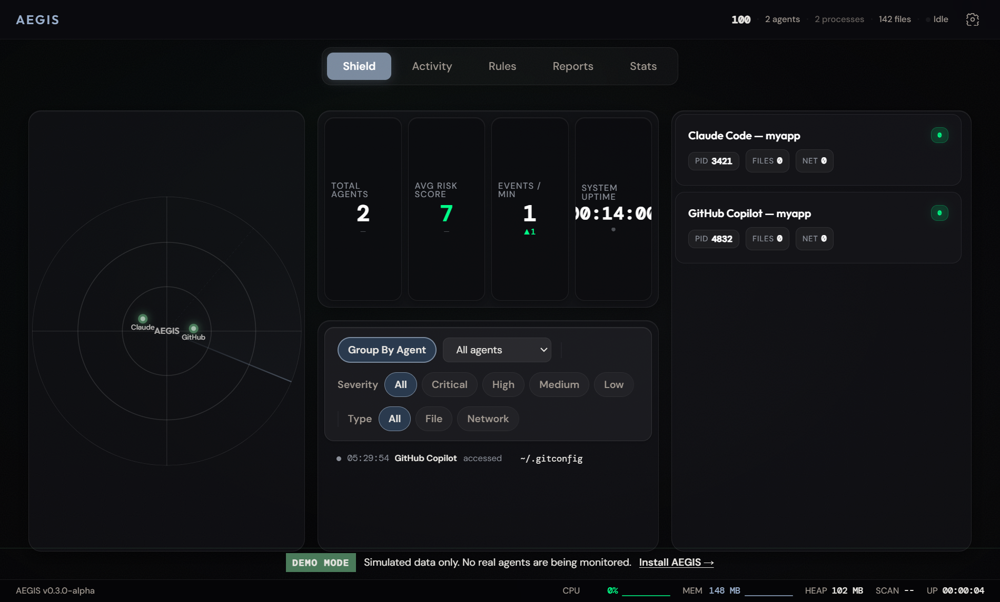
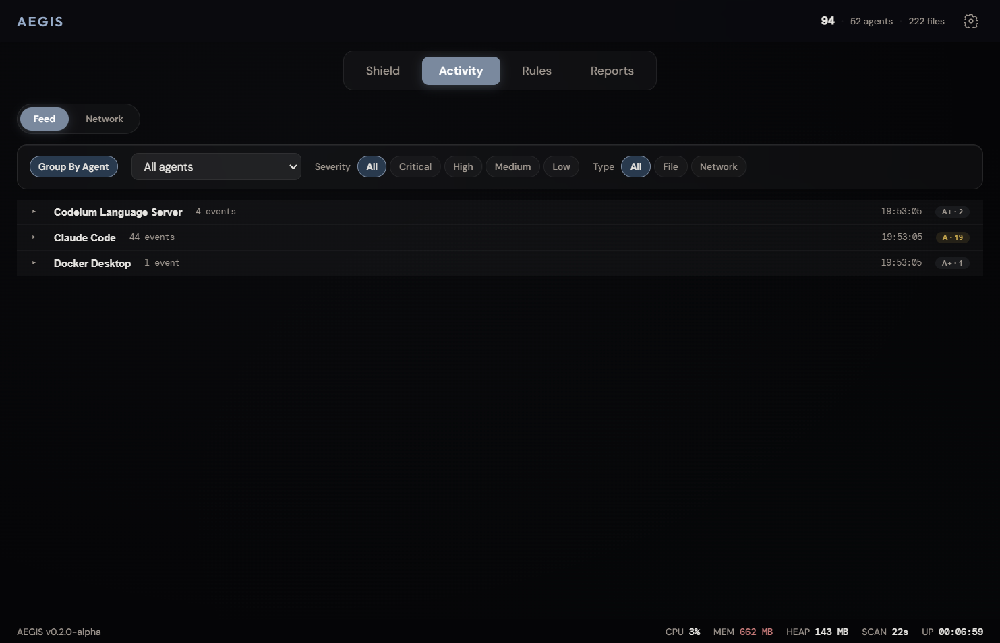
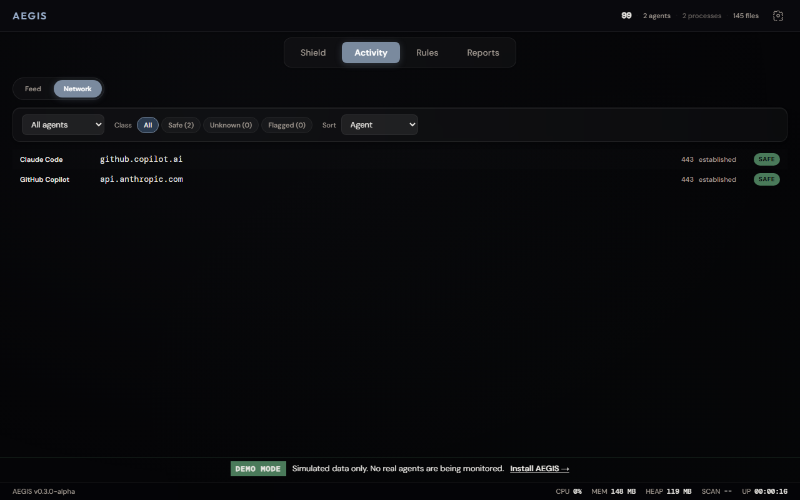
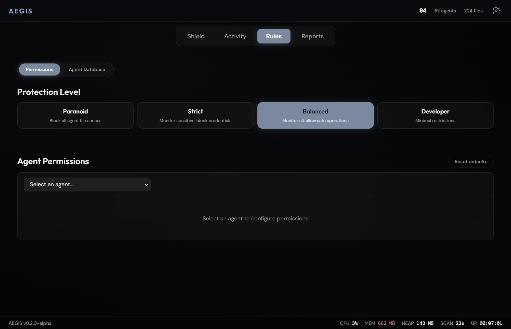
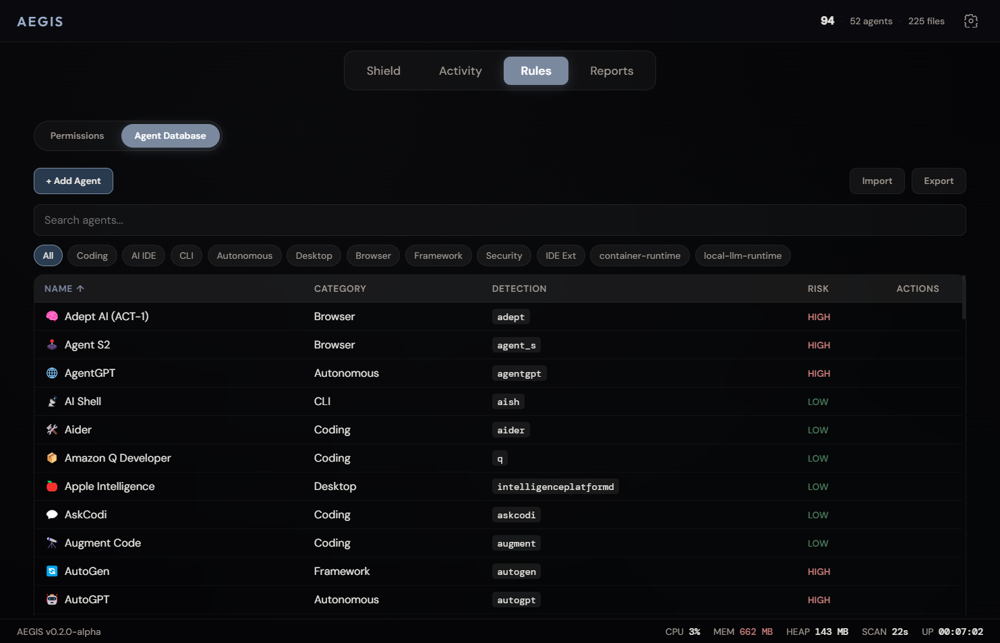
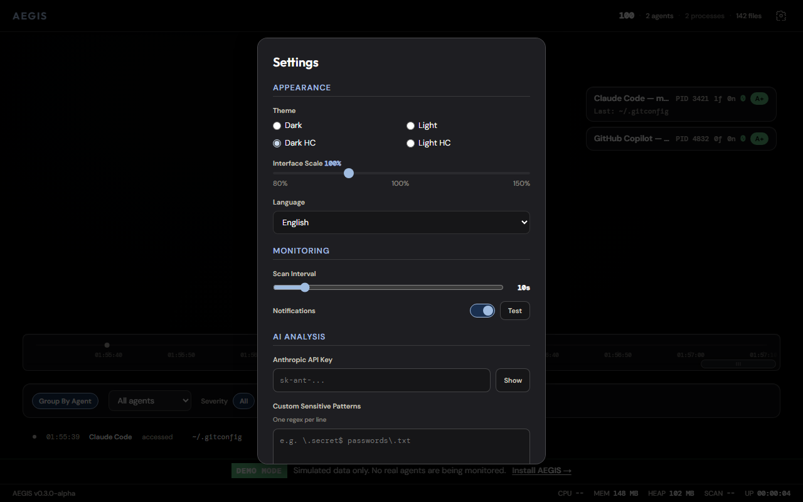

<p align="center">
  <h1 align="center">AEGIS</h1>
  <p align="center"><b>Independent AI Oversight Layer</b><br>Monitors what AI agents do on your computer.</p>
  <p align="center">No telemetry · No cloud · Everything stays local</p>
</p>

<p align="center">
  
</p>

<p align="center">
  
  
  
  
</p>

<p align="center">
  
  
  
  
</p>

<p align="center">
  
  
  
  
  
</p>

<p align="center">
  
  
  
  
  
</p>

<p align="center">
  <a href="#how-it-works">📖 Docs</a> ·
  <a href="#download">💾 Download</a> ·
  <a href="https://github.com/antropos17/Aegis/issues/new?template=bug-report.md">🐛 Report Bug</a> ·
  <a href="https://github.com/antropos17/Aegis/issues/new?template=feature-request.md">💡 Feature Request</a> ·
  <a href="CONTRIBUTING.md">🤝 Contributing</a>
</p>

<details>
<summary>📋 Table of Contents</summary>

- [Why AEGIS?](#why-aegis)
- [What AEGIS Does / Does NOT Do](#what-aegis-does--does-not-do)
- [Download](#download)
- [What It Monitors](#what-it-monitors)
- [Features](#features)
- [Quick Start](#quick-start)
- [How It Works](#how-it-works)
- [Screenshots](#screenshots)
- [Agent Database](#agent-database)
- [Building from Source](#building-from-source)
- [Testing](#testing)
- [Roadmap](#roadmap)
- [Contributors](#contributors)
- [License](#license)
- [Star History](#star-history)

</details>

## Why AEGIS?

AI agents now have deep access to your machine. They read files, scan codebases, execute commands, make network connections. Every existing AI security tool is enterprise B2B. They monitor what humans send *to* AI. Nobody monitors what AI agents do *on local machines*.

AEGIS is an independent, open-source monitoring layer. It watches AI agent behavior in real time, doesn't belong to any AI vendor, and keeps all data local. No telemetry, no cloud sync, no tracking.

<p align="right"><a href="#-aegis">⬆ back to top</a></p>

## What AEGIS Does / Does NOT Do

| ✅ Does | ❌ Does NOT |
|---------|------------|
| Monitor AI agent processes | Block or kill processes |
| Detect anomalies (4 axes) | Send data anywhere |
| Scan local LLM runtimes | Require internet |
| Log file access | Modify your files |
| Track network connections | Access your conversations |
| CLI JSON output | |

<p align="right"><a href="#-aegis">⬆ back to top</a></p>

## Download

**Windows**: [AEGIS Setup 0.3.0-alpha.exe](https://github.com/antropos17/Aegis/releases/latest) (~82 MB)

No Node.js required. Download, install, run.

> macOS and Linux support is experimental (PR [#37](https://github.com/antropos17/Aegis/pull/37)).

<p align="right"><a href="#-aegis">⬆ back to top</a></p>

## What It Monitors

- **Processes**: detects 98 AI agents by matching running processes against known signatures. Resolves parent-child process trees to find agents inside editors (e.g. Copilot in VS Code).
- **Files**: watches sensitive directories (`.ssh`, `.aws`, `.gnupg`, `.env*`, cloud configs) and 27 AI agent config dirs. Classifies access against 70+ sensitive file patterns.
- **Network**: scans outbound TCP connections per agent PID. Reverse DNS with domain classification. Known API endpoints vs. unknown/suspicious destinations.
- **Behavior**: rolling 10-session baselines per agent. Multi-dimensional anomaly scoring, 4-axis breakdown: Network (0.30), FileSystem (0.25), Process (0.25), Baseline (0.20).
- **Local LLMs**: detects Ollama (`localhost:11434`) and LM Studio (`localhost:1234`). Reports loaded models and running status.

<p align="right"><a href="#-aegis">⬆ back to top</a></p>

## Features

**Detection**
- 98 known agent signatures + wildcard matching for unknown agents
- Parent chain resolution with IDE host annotation
- AI agent config directory protection (Hudson Rock threat vector)
- Per-agent risk scoring with time decay and trust grades (A+ through F)
- Local LLM runtime detection (Ollama, LM Studio, vLLM, llama.cpp)

**Analysis**
- Behavioral baselines with rolling session averages
- Multi-dimensional anomaly detection (Network, FileSystem, Process, Baseline)
- AI threat assessment via Anthropic API (opt-in, you click the button)
- Printable HTML threat reports

**Dashboard**
- Canvas radar with agent orbits and sweep arm (60fps)
- Activity feed with filters (agent, severity, filetype)
- Session timeline with color-coded event dots
- Agent cards with trust bars, risk scores, expandable details
- Protection presets: Paranoid / Strict / Balanced / Developer
- Dark/light neumorphic theme

**Export**
- JSON, CSV, HTML report generation
- Audit logging (JSONL, daily rotation, 30-day retention)

**CLI**
```bash
aegis --scan-json    # JSON output for scripts
aegis --version      # Show version
aegis --help         # Show help
```

<p align="right"><a href="#-aegis">⬆ back to top</a></p>

## Quick Start

```bash
git clone https://github.com/antropos17/Aegis.git
cd Aegis
npm install && npm start
```

Needs Node.js 18+ and Windows 10/11. Mac/Linux work experimentally.

### CLI Usage

```bash
npx electron src/main/main.js --scan-json   # scan + print JSON
npx electron src/main/main.js --version     # print version
```

Optional: set your Anthropic API key in Settings for AI threat analysis.

<p align="right"><a href="#-aegis">⬆ back to top</a></p>

## How It Works

```
┌─────────────┐    ┌─────────────┐    ┌─────────────┐    ┌─────────────┐
│   Process    │    │    File     │    │   Network   │    │     LLM     │
│   Scanner    │    │   Watcher   │    │   Monitor   │    │  Detector   │
│  (tasklist)  │    │ (chokidar)  │    │ (NetTCP+DNS)│    │(Ollama/LMS) │
└──────┬───────┘    └──────┬──────┘    └──────┬──────┘    └──────┬──────┘
       │                   │                  │                  │
       └───────────┬───────┴──────────┬───────┘                  │
                   │                  │                           │
            ┌──────▼──────┐    ┌──────▼──────┐                   │
            │  Baseline   │    │   Anomaly   │◄──────────────────┘
            │   Engine    │    │  Detector   │
            │(10-session) │    │  (4-axis)   │
            └──────┬──────┘    └──────┬──────┘
                   │                  │
            ┌──────▼──────┐    ┌──────▼──────┐    ┌─────────────┐
            │    Risk     │    │   Audit     │    │     CLI     │
            │   Engine    │    │   Logger    │    │ (--scan-json│
            │(time-decay) │    │  (JSONL/30d)│    │  --version) │
            └──────┬──────┘    └─────────────┘    └─────────────┘
                   │
            ┌──────▼──────┐
            │  Dashboard  │
            │ (Svelte IPC)│
            └─────────────┘
```

Everything flows to the dashboard via Electron IPC. AI analysis only calls the Anthropic API when you click the button.

<p align="right"><a href="#-aegis">⬆ back to top</a></p>

## Screenshots

<table>
  <tr>
    <td align="center"><br><b>Shield Tab</b></td>
    <td align="center"><br><b>Activity Feed</b></td>
    <td align="center"><br><b>Network Monitor</b></td>
  </tr>
  <tr>
    <td align="center"><br><b>Rules & Permissions</b></td>
    <td align="center"><br><b>Agent Database</b></td>
    <td align="center"><br><b>Settings</b></td>
  </tr>
</table>

<p align="right"><a href="#-aegis">⬆ back to top</a></p>

## Agent Database

98 agents in [`src/shared/agent-database.json`](src/shared/agent-database.json), organized by category:

- **Coding assistants**: Claude Code, GitHub Copilot, OpenAI Codex, Cursor, Windsurf, Tabnine, Amazon Q, Cody, Aider
- **Autonomous agents**: Devin, Manus AI, OpenHands, SWE-Agent, AutoGPT, BabyAGI, CrewAI
- **Desktop/browser**: Anthropic Computer Use, Google Gemini, Apple Intelligence, Microsoft Copilot
- **CLI/frameworks**: LangChain, Semantic Kernel, AutoGen, MetaGPT, TaskWeaver
- **Security/DevOps**: Snyk AI, GitHub Advanced Security
- **Local LLM runtimes**: Ollama, LM Studio, vLLM, llama.cpp, LocalAI, GPT4All, Jan, text-generation-webui

Add custom agents in the UI or edit the JSON directly. See [AGENTS.md](AGENTS.md) for contributing new signatures.

<p align="right"><a href="#-aegis">⬆ back to top</a></p>

## Building from Source

```bash
git clone https://github.com/antropos17/Aegis.git
cd Aegis
npm install
npm run dev          # Development mode
npm run build        # Production build (electron-builder)
npm test             # Run 408 tests
npm run lint         # Check formatting
```

<p align="right"><a href="#-aegis">⬆ back to top</a></p>

## Testing

408 tests across 23 test files. Covers process scanning, file classification, network monitoring, risk scoring, anomaly detection, config management, baselines, logging, CLI, and platform parsers. Uses [Vitest](https://vitest.dev/) with `v8` coverage.

```bash
npm test              # run all tests once
npm run test:watch    # watch mode
npm run test:coverage # coverage report
```

<p align="right"><a href="#-aegis">⬆ back to top</a></p>

## Roadmap

- [ ] GPU monitoring for local inference detection
- [ ] OS-level enforcement via kernel hooks (Windows Minifilter, macOS Endpoint Security, Linux eBPF)
- [ ] Per-process file attribution (ETW on Windows, fanotify on Linux)
- [ ] Container/VM detection (Docker socket, WSL interop)
- [ ] UI awareness via Accessibility APIs
- [ ] Browser extension for web-based AI agents
- [ ] Cross-device AI activity correlation
- [ ] Auto-update mechanism
- [ ] i18n / localization

[📋 Full roadmap on GitHub Issues](https://github.com/antropos17/Aegis/issues)

<p align="right"><a href="#-aegis">⬆ back to top</a></p>

## Contributors

<table>
  <tr>
    <td align="center"><a href="https://github.com/antropos17"><br/><sub><b>Ruslan Murtuzaliyev</b></sub></a><br/>💻 📖 🚇 🎨</td>
    <td align="center"><a href="https://github.com/ElshadHu"><br/><sub><b>Elshad Humbatli</b></sub></a><br/>💻 🧪</td>
    <td align="center"><a href="https://github.com/skmelendez"><br/><sub><b>Steven Melendez</b></sub></a><br/>💻 🤔</td>
  </tr>
</table>

See [CONTRIBUTING.md](CONTRIBUTING.md) · [SECURITY.md](SECURITY.md)

<p align="right"><a href="#-aegis">⬆ back to top</a></p>

## License

MIT. See [LICENSE](LICENSE).

## Star History

[](https://star-history.com/#antropos17/Aegis&Date)
