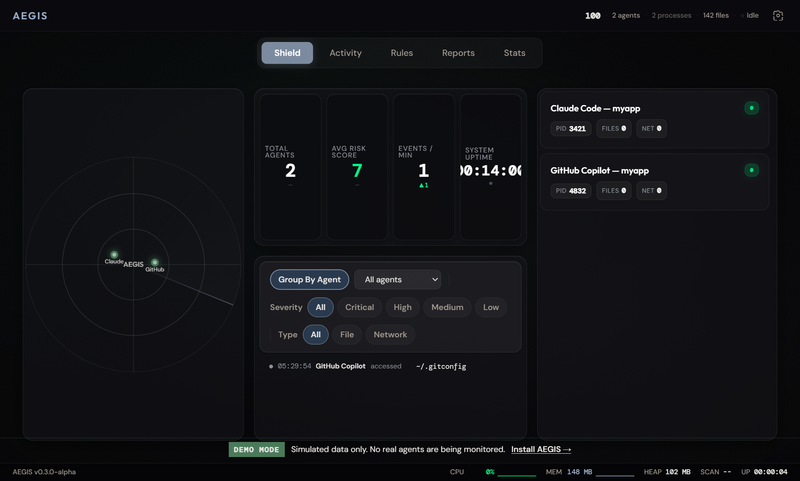
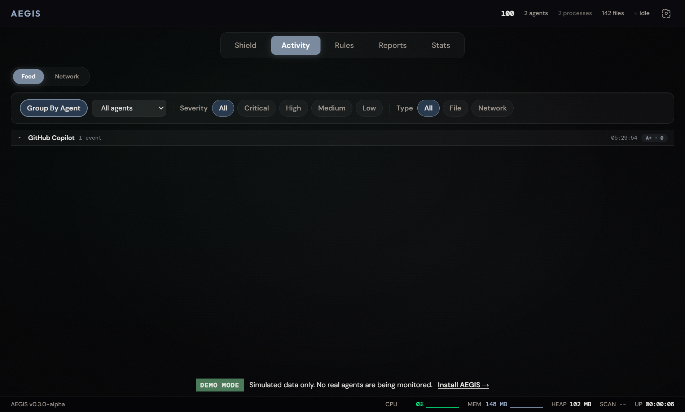
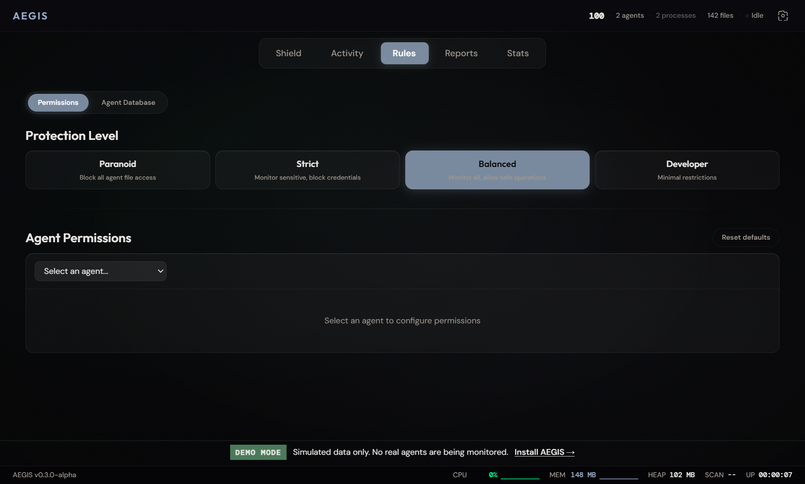
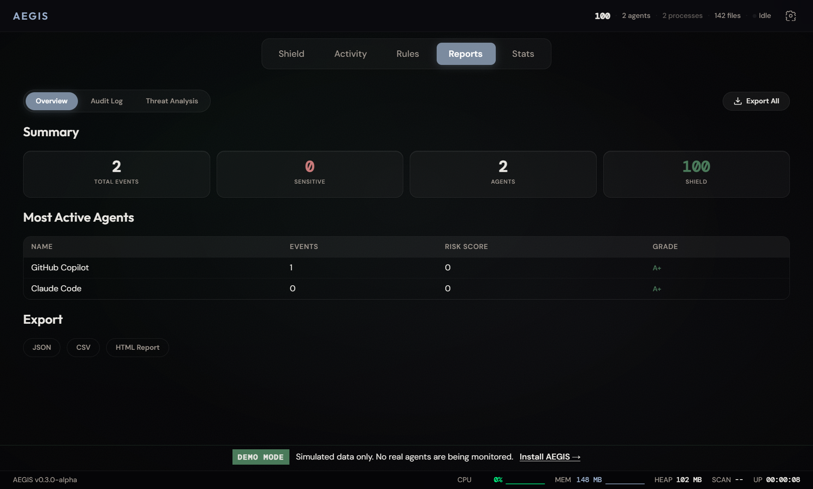
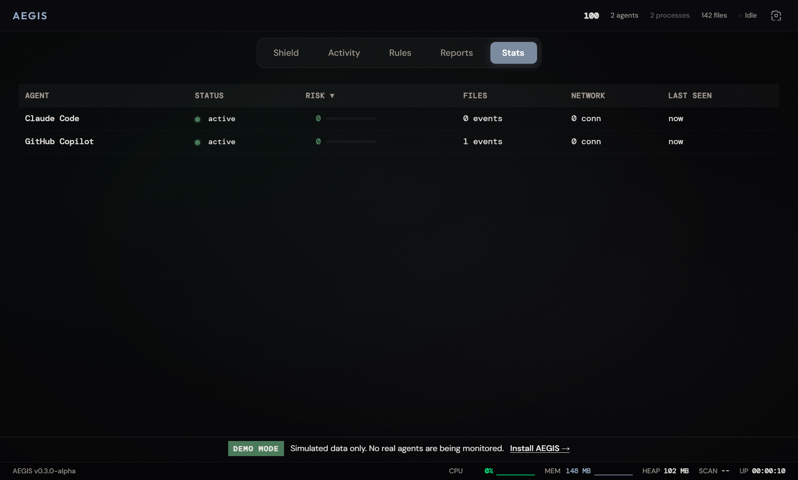
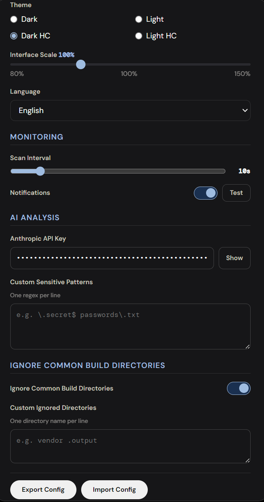

<p align="center">
  <h1 align="center">AEGIS</h1>
  <p align="center"><b>EDR for AI Agents</b></p>
</p>

**Aegis is an open-source endpoint detection and response (EDR) tool that monitors AI agent processes, file access, network activity, and behavioral anomalies in real time.** Built with Electron 33, Svelte 5, and TypeScript, it provides the same class of oversight for autonomous AI agents that CrowdStrike provides for traditional endpoints. No telemetry. No cloud. Everything stays local.

> "Kaspersky found 512 bugs in OpenClaw. So we built an EDR to monitor it."

<p align="center">
  <a href="https://github.com/antropos17/Aegis/releases/latest"></a>
  
  
  
  
</p>

<p align="center">
  
</p>

<p align="center">
  <a href="#download">Download</a> &middot;
  <a href="https://github.com/antropos17/Aegis/issues/new?template=01-bug-report.yml">Report Bug</a> &middot;
  <a href="https://github.com/antropos17/Aegis/issues/new?template=02-feature-request.yml">Feature Request</a> &middot;
  <a href="CONTRIBUTING.md">Contributing</a>
</p>

---

## What Does Aegis Monitor?

- **Process Monitoring** — Tracks 107 known AI agent signatures with parent-child tree resolution and IDE host detection.
- **File System Access** — Watches sensitive directories (`.ssh`, `.aws`, `.gnupg`, `.env`, cloud configs) and 27 AI agent config paths for unauthorized access.
- **Network Activity** — Logs outbound TCP connections per agent PID with reverse DNS and known-vs-unknown API endpoint classification.
- **Behavioral Analysis** — Applies 68 detection rules across 8 categories with rolling 10-session baselines and 4-axis anomaly scoring.
- **Trust Scoring** — Assigns real-time risk scores with trust grades (A+ through F) using time-decay algorithms and multi-dimensional threat assessment.
- **Multi-Agent Dashboard** — Displays all 107 agents in a bento-grid dashboard with sparklines, risk rings, activity feeds, and expandable agent cards.

## Why Aegis?

| | |
|---|---|
| **512** | vulnerabilities found in OpenClaw by Kaspersky — autonomous agents ship with real security risks |
| **0** | open-source EDR tools existed for AI agents before Aegis |
| **107** | AI agent signatures in the detection database, from Claude Code to AutoGPT |
| **68** | behavioral detection rules across 8 categories, with hot-reload and custom overrides |
| **707** | tests passing, 0 failures — the monitoring engine is verified on every commit |
| **<2s** | cold boot to full dashboard — lightweight enough to run alongside the agents it monitors |

AI agents now have deep access to your machine — files, commands, network. Every existing AI security tool is enterprise SaaS that monitors what humans send *to* AI. Nobody monitors what AI agents do *on local machines*. Aegis is the open-source answer.

## What It Monitors

| Layer | How |
|-------|-----|
| **Processes** | 107 known AI agent signatures, parent-child tree resolution, IDE host detection |
| **Files** | Watches `.ssh`, `.aws`, `.gnupg`, `.env*`, cloud configs, 27 AI agent config dirs |
| **Network** | Outbound TCP per agent PID, reverse DNS, known API endpoints vs unknown |
| **Behavior** | Rolling 10-session baselines, 4-axis anomaly scoring (Network/FS/Process/Baseline) |
| **Local LLMs** | Ollama, LM Studio, vLLM, llama.cpp runtime detection |

## How It Compares

| | AEGIS | Lasso / Prompt Security / PromptArmor |
|-|:-----:|:--------------------------------------:|
| Runs locally | Yes | Cloud |
| Open source | MIT | No |
| Free | Yes | Enterprise |
| Monitors file access | Yes | No |
| Detects local LLMs | Yes | No |

> **AEGIS is the only open-source, local-first AI agent monitor.**

## Download

### From Source (all platforms)
```bash
git clone https://github.com/antropos17/Aegis.git
cd Aegis
npm install
npm start
```

> Requires **Node.js 18+** and **npm 9+**. Windows 10/11 recommended. macOS/Linux experimental ([#37](https://github.com/antropos17/Aegis/issues/37)).

### Try Without AI Agents

Don't have AI agents running? Demo mode lets you explore the full dashboard with simulated data — no real monitoring, no real processes.

```bash
npm run build:demo && npm start
```

Demo mode runs a scenario engine that cycles through four threat phases — **calm → elevated → critical → reset** — with up to 12 simulated AI agents (Claude Code, Copilot, Cursor, and more). File access events, network connections, anomaly scores, and risk assessments are all generated in real time so every tab and feature is fully functional.

Use it to evaluate AEGIS before deploying, demo the UI to your team, or develop new features without needing a live Windows environment.

### Windows Installer

Pre-built `.exe` installer is coming in a future release. Track progress in [Releases](https://github.com/antropos17/Aegis/releases).

<!-- TODO: uncomment when CI builds .exe
[](https://github.com/antropos17/Aegis/releases/latest)
-->

### Release History

| Version | Date | Highlights |
|---------|------|------------|
| [v0.10.0-alpha](https://github.com/antropos17/Aegis/releases/tag/aegis-v0.10.0-alpha) | 2026-03-09 | Code cleanup, security hardening, command palette |
| [v0.9.1-alpha](https://github.com/antropos17/Aegis/releases/tag/aegis-v0.9.1-alpha) | 2026-03-08 | Dropdown dedup, skill paths, aegis-context optimized |
| [v0.9.0-alpha](https://github.com/antropos17/Aegis/releases/tag/aegis-v0.9.0-alpha) | 2026-03-08 | categoryIndex, prompt-craft skill, TS migration stores |
| [v0.8.2-alpha](https://github.com/antropos17/Aegis/releases/tag/aegis-v0.8.2-alpha) | 2026-03-08 | formatBytes TS extraction, meaningful tests, branch cleanup |
| [v0.8.1-alpha](https://github.com/antropos17/Aegis/releases/tag/aegis-v0.8.1-alpha) | 2026-03-07 | Patch release |
| [v0.8.0-alpha](https://github.com/antropos17/Aegis/releases/tag/aegis-v0.8.0-alpha) | 2026-03-05 | Launch readiness: CSP hardened, OpenClaw integration, README overhaul |
| [v0.7.0-alpha](https://github.com/antropos17/Aegis/releases/tag/aegis-v0.7.0-alpha) | 2026-03-04 | YAML rulesets, 68 rules, hot-reload, 568 tests |
| [v0.5.0-alpha](https://github.com/antropos17/Aegis/releases/tag/aegis-v0.5.0-alpha) | 2026-03-03 | Fancy UI redesign, VisTimeline, AgentGraph |
| [v0.4.0-alpha](https://github.com/antropos17/Aegis/releases/tag/aegis-v0.4.0-alpha) | 2026-03-03 | TypeScript infrastructure, perf, refactoring |

## Features

**Detection** — 107 agent signatures, parent chain resolution, config dir protection, per-agent risk scoring with trust grades (A+ through F), HTTP/User-Agent scoring, local LLM detection, false positive marking

**Analysis** — Behavioral baselines with rolling averages, multi-dimensional anomaly detection, AI threat assessment via Anthropic API (opt-in), printable HTML threat reports

**Dashboard** — Bento grid dashboard — RiskRing gauge, Sparklines, TrustBadge, agent stats, activity feed with filters, session timeline, agent cards with expandable details, protection presets (Paranoid/Strict/Balanced/Developer), dark/light theme, toast notifications, OOM protection, keyboard shortcuts (Ctrl+1-4)

**Export** — JSON, CSV, HTML reports, one-click ZIP archive, JSONL audit logging (daily rotation, 30-day retention)

**i18n** — Internationalization with English base (110+ strings), community translations welcome

**CLI** — `--scan-json` for scripting, `--version`, `--help`

## YAML Rulesets

- 68 detection rules across 8 categories (AI config, secrets, SSH, cloud, browser, devtools, crypto, certificates)
- JSON Schema validated, hot-reload without restart
- Extend or override via `rules/custom/` directory

## Screenshots

<details><summary>📸 Shield — Real-time Overview</summary>

</details>

<details><summary>📸 Activity Feed</summary>

</details>

<details><summary>📸 Rules & Permissions</summary>

</details>

<details><summary>📸 Reports & Export</summary>

</details>

<details><summary>📸 Agent Statistics</summary>

</details>

<details><summary>📸 Settings</summary>

</details>

## Architecture

```
┌─────────────┐    ┌─────────────┐    ┌─────────────┐    ┌─────────────┐
│   Process    │    │    File     │    │   Network   │    │     LLM     │
│   Scanner    │    │   Watcher   │    │   Monitor   │    │  Detector   │
│  (tasklist)  │    │ (chokidar)  │    │ (NetTCP+DNS)│    │(Ollama/LMS) │
└──────┬───────┘    └──────┬──────┘    └──────┬──────┘    └──────┬──────┘
       │                   │                  │                  │
       └───────────┬───────┴──────────┬───────┘                  │
                   │                  │                           │
            ┌──────▼──────┐    ┌──────▼──────┐                   │
            │  Baseline   │    │   Anomaly   │◄──────────────────┘
            │   Engine    │    │  Detector   │
            │(10-session) │    │  (4-axis)   │
            └──────┬──────┘    └──────┬──────┘
                   │                  │
            ┌──────▼──────┐    ┌──────▼──────┐    ┌─────────────┐
            │    Risk     │    │   Audit     │    │     CLI     │
            │   Engine    │    │   Logger    │    │ (--scan-json│
            │(time-decay) │    │  (JSONL/30d)│    │  --version) │
            └──────┬──────┘    └──────┬──────┘    └─────────────┘
                   │                  │
            ┌──────▼──────┐    ┌──────▼──────┐
            │  Dashboard  │    │ ZIP Writer  │
            │ (Svelte IPC)│    │ (export)    │
            └─────────────┘    └─────────────┘
```

**Stack**: Electron 33, Svelte 5, Vite 7, TypeScript, Vitest (707 tests across 44 files)

## Agent Database

107 agents in [`src/shared/agent-database.json`](src/shared/agent-database.json):

**Coding** — Claude Code, GitHub Copilot, Cursor, Windsurf, Tabnine, Amazon Q, Cody, Aider
**Autonomous** — OpenClaw, Devin, Manus AI, OpenHands, SWE-Agent, AutoGPT, BabyAGI, CrewAI
**Desktop** — Anthropic Computer Use, Google Gemini, Apple Intelligence, Microsoft Copilot
**Frameworks** — LangChain, Semantic Kernel, AutoGen, MetaGPT, TaskWeaver
**Local LLMs** — Ollama, LM Studio, vLLM, llama.cpp, LocalAI, GPT4All, Jan

Add custom agents via the UI or edit the JSON. See [AGENTS.md](AGENTS.md).

## Roadmap

- [ ] GPU monitoring for local inference detection
- [ ] OS-level enforcement (Windows Minifilter, macOS Endpoint Security, Linux eBPF)
- [ ] Per-process file attribution (ETW, fanotify)
- [ ] Container/VM detection (Docker, WSL)
- [ ] Browser extension for web-based AI agents
- [ ] Auto-update mechanism
- [x] i18n / localization ([#53](https://github.com/antropos17/Aegis/issues/53))

## Frequently Asked Questions

### What is Aegis?

Aegis is an open-source endpoint detection and response (EDR) tool purpose-built for monitoring AI agents. It tracks processes, file access, network activity, and behavioral anomalies in real time using Electron 33, Svelte 5, and TypeScript. All data stays local — no telemetry, no cloud dependency.

### Why do AI agents need monitoring?

Autonomous AI agents like OpenClaw, AutoGPT, and Devin have deep access to local files, credentials, and shell commands — yet run with minimal oversight. Kaspersky's analysis found 512 bugs in OpenClaw alone. Aegis provides the missing observability layer so you can see exactly what agents do on your machine.

### How is Aegis different from traditional EDR?

Traditional EDR tools (CrowdStrike, Sentinel One) monitor human-driven threats — malware, ransomware, phishing. Aegis is built specifically for AI agent behavior: it ships with 107 agent profiles, 68 detection rules tuned for agent-specific patterns, and behavioral baselines that track how each agent's activity changes over time.

### Does Aegis work with MCP tools?

Yes. Aegis monitors any AI agent process running on your machine, including tools connected via the Model Context Protocol (MCP). If an MCP-connected tool spawns processes, accesses files, or makes network calls, Aegis will detect and score that activity.

### Is Aegis a replacement for sandboxing?

No. Aegis is an observability layer, not a restriction layer. Sandboxes limit what agents can do; Aegis shows you what agents are doing. They are complementary — use sandboxing for enforcement and Aegis for visibility, auditing, and anomaly detection.

### What agents does Aegis support?

Aegis ships with 107 agent signatures across five categories: coding assistants (Claude Code, Copilot, Cursor), autonomous agents (OpenClaw, AutoGPT, CrewAI, Devin), desktop AI (Gemini, Apple Intelligence), frameworks (LangChain, AutoGen, MetaGPT), and local LLMs (Ollama, LM Studio, llama.cpp). You can add custom agents via the UI or JSON config.

### Can I use Aegis in production?

Aegis is currently at v0.10.0-alpha and is recommended for development and testing environments. The core monitoring engine is stable with 707 tests passing, but production deployment features (auto-update, OS-level enforcement) are on the roadmap for v1.0.

### Is Aegis free?

Yes. Aegis is released under the MIT license with no telemetry, no cloud requirements, and no paid tiers. The full source code is available on GitHub.

## Contributors

<table>
  <tr>
    <td align="center"><a href="https://github.com/antropos17"><br/><sub><b>Antropos7</b></sub></a></td>
    <td align="center"><a href="https://github.com/ElshadHu"><br/><sub><b>Elshad Humbatli</b></sub></a></td>
    <td align="center"><a href="https://github.com/skmelendez"><br/><sub><b>Steven Melendez</b></sub></a></td>
    <td align="center"><a href="https://github.com/travisbreaks"><br/><sub><b>travisbreaks</b></sub></a></td>
    <td align="center"><a href="https://github.com/raye-deng"><br/><sub><b>raye-deng</b></sub></a></td>
    <td align="center"><a href="https://github.com/KJyang-0114"><br/><sub><b>KJyang-0114</b></sub></a></td>
  </tr>
</table>

[CONTRIBUTING.md](CONTRIBUTING.md) &middot; [SECURITY.md](SECURITY.md) &middot; [CODE_OF_CONDUCT.md](CODE_OF_CONDUCT.md)

## Support

If Aegis is useful to you, consider giving it a star on GitHub — it helps others discover the project.

**Teams & Enterprise** — Need centralized dashboards, SIEM integration, or managed deployment? We're building it. [Get notified](mailto:aegis@antropos17.dev?subject=Aegis%20Enterprise%20Interest)

## License

[MIT](LICENSE)

## Star History

[](https://www.star-history.com/?repos=antropos17%2FAegis&type=timeline&legend=top-left)
