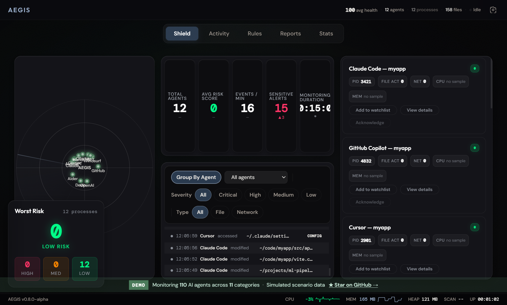
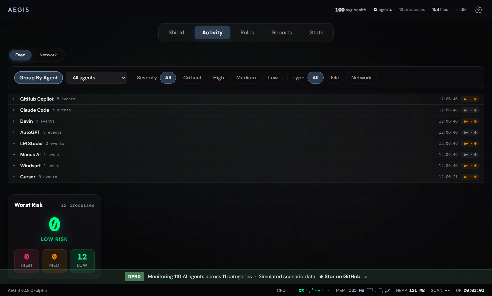
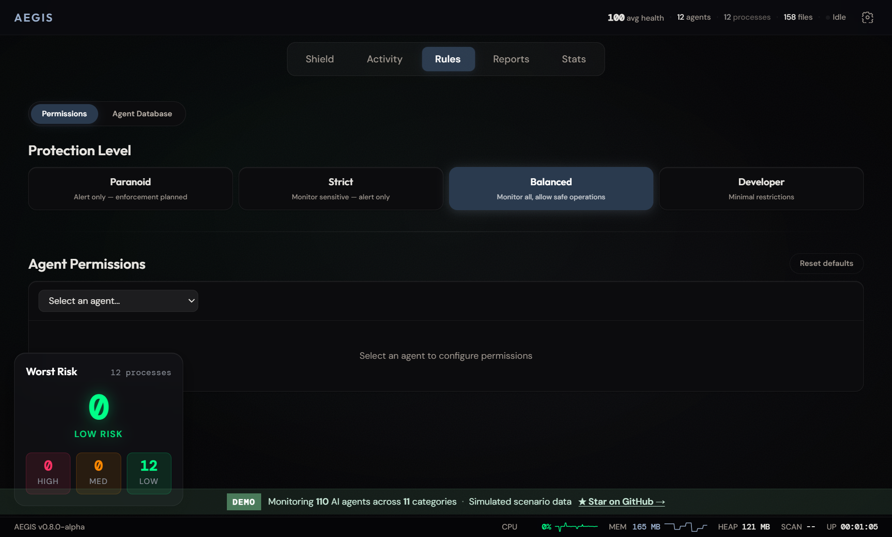
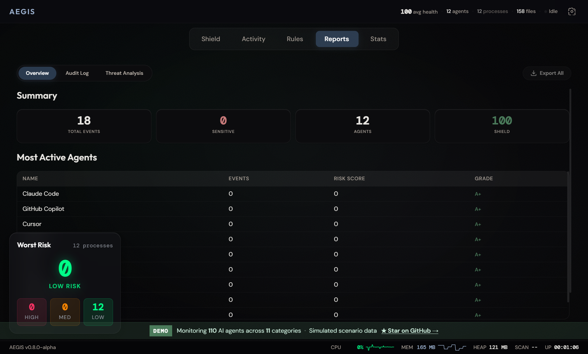
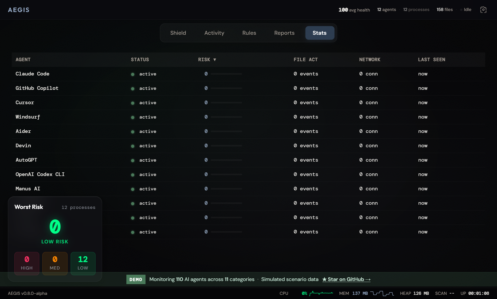
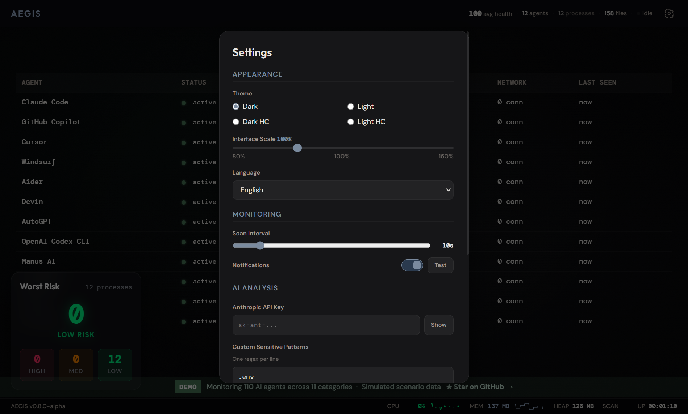

<p align="center">
  <h1 align="center">AEGIS</h1>
  <p align="center"><b>Independent, OS-level observability for AI coding agents</b></p>
  <p align="center"><i>Watches what AI agents actually do on your machine — processes, files, network — from outside the agents, no hooks required.</i></p>
</p>

**AEGIS is an independent, OS-level observer for AI agents.** It watches agent processes, file access, and network activity regardless of how the agent was launched or whether it cooperates with monitoring — and it ties every observation to a specific agent *instance*, with the evidence for that attribution stated on the record. Built on a CommonJS JavaScript monitoring engine, with TypeScript in the renderer and the shared types. **Open-source, local, no telemetry** — everything stays on your machine.

<p align="center">
  <a href="https://github.com/antropos17/Aegis/releases/latest"></a>
  
  <a href="#monitor-first"></a>
  
  
</p>

<p align="center">
  <br>
  <sub>Demo recorded at v0.10.0-alpha; some labels have been renamed since.</sub>
</p>

<p align="center">
  <a href="#download">Download</a> &middot;
  <a href="https://github.com/antropos17/Aegis/issues/new?template=01-bug-report.yml">Report Bug</a> &middot;
  <a href="https://github.com/antropos17/Aegis/issues/new?template=02-feature-request.yml">Feature Request</a> &middot;
  <a href="CONTRIBUTING.md">Contributing</a>
</p>

---

## What AEGIS observes

| Layer | How |
|-------|-----|
| **Processes** | 110 agents (262 process-name signatures), parent-chain resolution, IDE host detection, WSL and IDE-extension discovery |
| **Files** | chokidar watch on sensitive directories (`.ssh`, `.aws`, `.gnupg`, `.env*`, cloud configs) and the registered config paths of known agents; open-handle and Restart-Manager read detection on Windows |
| **Network** | Outbound TCP per agent process, forward-confirmed reverse DNS, and a verdict per endpoint — `allowlisted`, `unknown`, or `flagged`; an unidentified endpoint is never displayed as safe |
| **Behavior** | 73 detection rules across 8 categories (YAML, hot-reloaded), rolling 10-session baselines, anomaly scoring over four axes (network / filesystem / process / baseline) |
| **Local LLMs** | Runtime probes for Ollama and LM Studio, including loaded models; other runtimes such as vLLM and llama.cpp are detected by process signature |

The counted facts above are not hand-maintained: `npm run counts:check` re-derives every documented counter from the tree on each CI run and fails the build when a number in the docs drifts from reality.

## The evidence graph

What separates AEGIS from a process viewer is not the sensors — it is that every event is attached to an agent **instance**, with evidence you can audit:

- **Instance identity.** An agent is keyed as `pid` + OS birth time (`instanceId`), so a recycled PID is a new instance, not a continuation of the old one's history. Identity caching is gated by a witness, and CI runs an injection proof (`npm run verify:gate`, 4 mutants) that goes red if an identity could ever be served from a stale cache.
- **Attribution with stated evidence.** Every audit record carries `pid`, `instanceId`, and an `attribution` object with one of three statuses — confirmed, inferred, or unattributed — backed by a closed registry of evidence codes. When AEGIS does not know which agent touched a file, it says *unattributed*; it never invents an owner.
- **Tamper-evident log.** Audit events are hash-chained JSONL (Event Schema v1) with daily rotation, 30-day retention, and explicit loss markers when the write buffer overflows.
- **Measured, not asserted.** The identity mechanism is benchmarked in-repo: provider birth-time parity was exact for every comparable process in both recorded runs (542/542 and 419/419), and the process-snapshot sidecar costs ~10 ms per scan where the fallback provider costs hundreds to thousands. Per-run tables, environments, and the stated gaps are in [docs/bench/](docs/bench/).

Evidence: [`src/main/process-identity.js`](src/main/process-identity.js) · [`src/main/attribution.js`](src/main/attribution.js) · [correctness audit](docs/current-state/CORRECTNESS-AUDIT.md) · [bench 2026-08-12](docs/bench/generation-v2-2026-08-12.md) · [bench 2026-08-13](docs/bench/generation-v2-2026-08-13.md)

## Monitor-first

> **AEGIS is a camera, not a guard.** It **observes and logs** — it does **not** block agents at the OS level today. There are no kernel hooks and no automatic enforcement. Process control (kill / suspend / resume) is **manual and user-invoked** only. Active blocking is on the [roadmap](#roadmap), not in the current release. Use AEGIS for visibility, auditing, and anomaly detection — pair it with sandboxing when you need enforcement.

## How AEGIS differs from in-agent oversight

Most AI-agent oversight tools instrument the agent itself — a Claude Code plugin, an IDE extension, an SDK wrapper. That placement has a structural blind spot: an agent only shows up if it (or its user) installed the hook. A raw `python autogpt.py`, an unwrapped binary, or a tool that simply does not cooperate is invisible to in-agent instrumentation.

AEGIS sits at the OS layer instead: it watches process, file, and network activity from outside the agents, so what it sees does not depend on the agent's cooperation — only on AEGIS's own coverage (see [known limits](#known-limits)). It is not the only tool observing agents locally — [AgentSight](https://github.com/eunomia-bpf/agentsight), for example, observes from the eBPF layer on Linux — and hook-based tools are complementary rather than competing: hooks see intent (prompts, tool calls) inside the agents that opted in, while AEGIS sees effects (processes, files, connections) for whatever runs on the machine, linked to agent instances without requiring cooperation.

## Known limits

A monitor you cannot calibrate is a monitor you cannot trust, so the limits are stated here rather than discovered later. The re-verified findings behind this list, each with an OPEN/CLOSED status, live in the [correctness audit](docs/current-state/CORRECTNESS-AUDIT.md); the short version:

- **Coverage is signature- and heuristic-based.** Detection starts from 110 agents (262 process-name signatures) plus heuristics (WSL, IDE extensions, local LLM probes). An agent binary that matches none of these is not detected.
- **Polling has a blind spot.** A process born and dead between scan ticks (~10 s) is never observed; the bench pages state this explicitly. Per-event capture via ETW is on the [roadmap](#roadmap), with a static recon already in [docs/recon/kernel-file-etw.md](docs/recon/kernel-file-etw.md).
- **macOS/Linux identity is degraded.** Those platforms currently supply no OS birth time, so instance identity falls back to PID only and is unsafe under PID reuse. Token-cost tracking is Windows-only.
- **UI event windows truncate silently.** The renderer keeps bounded event windows that can disagree with totals, and there is no truncation banner yet.
- **Sensor health is tracked but not yet shown.** The main process records per-sensor health for the filesystem and network sensors, but the UI cannot yet distinguish a quiet machine from a dead sensor, and process-scan overruns are skipped without a counter.
- **Audit loss markers need a successful flush.** If the process is killed while the disk is still failing, evicted audit entries can be lost without an on-disk marker.

## What we deliberately do not claim

Numbers appear in this README only when they are derived from the repository (and enforced by `npm run counts:check`) or measured with a written-down method. Some numbers people ask for do not exist yet, so we do not state them:

- **Boot time.** No startup benchmark exists; the old "under two seconds" claim was removed rather than kept unmeasured.
- **Detection or false-positive rates.** A scenario bench with an independent oracle exists (`bench/`, scored against Sysmon/Procmon), but it is Windows-only, covers one scenario, and does not run in CI — not a basis for a rate.
- **Overhead.** AEGIS's own CPU/RAM cost has not been measured under a written-down method.
- **Benchmark speedup headlines.** The measured snapshot-vs-fallback ratio moved from 193× to 51× between two days on the same machine; the durable claim is the weaker one — snapshot ~10 ms, fallback hundreds to thousands of ms — and that is the only form quoted here.
- **Per-event confidence scores.** Deliberately absent from the product until a ground-truth bench exists.
- **Test counts.** Hand-copied suite counts go stale silently; the suite prints its own counts, and CI runs it on every commit.

## Why independent oversight

AI agents run with deep access to files, credentials, and shell commands. The risk is not hypothetical: Kaspersky's write-up of the OpenClaw case reports that a security audit in January 2026 identified **512 vulnerabilities, eight of them critical**, and argues that the deeper problem is architectural — privileged local access combined with the ability to communicate externally ([Kaspersky, 2026-02-10](https://www.kaspersky.com/blog/openclaw-vulnerabilities-exposed/55263/)). Patching fixes bugs; it does not give you visibility into what an agent actually did on your machine. That visibility is the layer AEGIS adds.

## Download

### Windows installer

Starting with v0.11.0-alpha, releases ship a Windows NSIS installer — download the `.exe` from the [latest release](https://github.com/antropos17/Aegis/releases/latest).

### From source (all platforms)

```bash
git clone https://github.com/antropos17/Aegis.git
cd Aegis
npm install
npm start
```

> Requires **Node.js 22.x** (`engines` in `package.json`). Windows 10/11 recommended; macOS/Linux experimental ([#37](https://github.com/antropos17/Aegis/issues/37)) — see [known limits](#known-limits).

### Try without AI agents

Don't have AI agents running? Demo mode lets you explore the full dashboard with simulated data — no real monitoring, no real processes.

```bash
npm run build:demo && npm start
```

Demo mode runs a scenario engine that cycles through four threat phases — **calm → elevated → critical → reset** — with up to 12 simulated AI agents (Claude Code, Copilot, Cursor, and more). File access events, network connections, anomaly scores, and risk assessments are all generated in real time so every tab and feature is fully functional.

Use it to evaluate AEGIS before deploying, demo the UI to your team, or develop new features without needing a live Windows environment.

### Release history

| Version | Date | Highlights |
|---------|------|------------|
| [v0.11.0-alpha](https://github.com/antropos17/Aegis/releases/tag/aegis-v0.11.0-alpha) | 2026-08-11 | Windows installer, Event Schema v1 attribution, endpoint verdicts, sensor health records, WSL & IDE-extension detection |
| [v0.10.0-alpha](https://github.com/antropos17/Aegis/releases/tag/aegis-v0.10.0-alpha) | 2026-03-09 | Code cleanup, security hardening, command palette |
| [v0.9.1-alpha](https://github.com/antropos17/Aegis/releases/tag/aegis-v0.9.1-alpha) | 2026-03-08 | Dropdown dedup, skill paths, aegis-context optimized |
| [v0.9.0-alpha](https://github.com/antropos17/Aegis/releases/tag/aegis-v0.9.0-alpha) | 2026-03-08 | categoryIndex, prompt-craft skill, TS migration stores |
| [v0.8.2-alpha](https://github.com/antropos17/Aegis/releases/tag/aegis-v0.8.2-alpha) | 2026-03-08 | formatBytes TS extraction, meaningful tests, branch cleanup |
| [v0.8.1-alpha](https://github.com/antropos17/Aegis/releases/tag/aegis-v0.8.1-alpha) | 2026-03-07 | Patch release |
| [v0.8.0-alpha](https://github.com/antropos17/Aegis/releases/tag/aegis-v0.8.0-alpha) | 2026-03-05 | Launch readiness: CSP hardened, OpenClaw integration, README overhaul |
| [v0.7.0-alpha](https://github.com/antropos17/Aegis/releases/tag/aegis-v0.7.0-alpha) | 2026-03-04 | YAML rulesets, 68 rules, hot-reload, 568 tests |
| [v0.5.0-alpha](https://github.com/antropos17/Aegis/releases/tag/aegis-v0.5.0-alpha) | 2026-03-03 | Fancy UI redesign, VisTimeline, AgentGraph |
| [v0.4.0-alpha](https://github.com/antropos17/Aegis/releases/tag/aegis-v0.4.0-alpha) | 2026-03-03 | TypeScript infrastructure, perf, refactoring |

## Features

**Detection** — 110 agents (262 process-name signatures), parent-chain resolution, sensitive-path and agent-config watching, per-agent risk scoring with trust grades (A+ through F), local LLM detection, false-positive marking

**Analysis** — Behavioral baselines with rolling averages, multi-axis anomaly detection, AI threat assessment via the Anthropic API (opt-in), printable HTML threat reports

**Dashboard** — Bento-grid dashboard: RiskRing gauge, TrustBadge, activity feed with filters, session timeline with attribution tooltips, expandable agent cards, protection presets (Paranoid/Strict/Balanced/Developer), command palette (Ctrl+K), keyboard shortcuts (Ctrl+1-5), dark/light theme, toast notifications, OOM protection

**Export** — JSON, CSV, HTML reports, one-click ZIP archive, hash-chained JSONL audit log (daily rotation, 30-day retention)

**i18n** — Internationalization with an English base (`en.json`); community translations welcome

**CLI** — `--scan-json` for scripting, `--version`, `--help`

## YAML Rulesets

- 73 detection rules across 8 categories (AI config, secrets, SSH, cloud, browser, devtools, crypto, certificates)
- Validated against `rules/_schema.json`; editing a ruleset hot-reloads without a restart
- Extend by adding a `.yaml` to `rules/`. Rule IDs must be unique — a duplicate ID is skipped, not overridden. A newly added file is picked up on the next reload or restart, since the watcher reacts to changes in existing top-level files

## Screenshots

> Captured at v0.10.0-alpha. Some labels have since been renamed ("System Uptime" → "Monitoring Duration", "Sensitive Files" → "Sensitive Alerts") — the renames are documented in the [correctness audit](docs/current-state/CORRECTNESS-AUDIT.md).

<details><summary>📸 Shield — Real-time Overview</summary>

</details>

<details><summary>📸 Activity Feed</summary>

</details>

<details><summary>📸 Rules & Permissions</summary>

</details>

<details><summary>📸 Reports & Export</summary>

</details>

<details><summary>📸 Agent Statistics</summary>

</details>

<details><summary>📸 Settings</summary>

</details>

## Architecture

```
┌───────────────┐  ┌────────────────┐  ┌───────────────┐  ┌───────────────┐
│   Process     │  │     File       │  │    Network    │  │  LLM Runtime  │
│   Snapshot    │  │    Watcher     │  │    Monitor    │  │   Detector    │
│ (sidecar with │  │  (chokidar +   │  │ (TCP + rDNS + │  │ (Ollama / LM  │
│  CIM fallback)│  │  handle / RM)  │  │   verdicts)   │  │    Studio)    │
└──────┬────────┘  └──────┬─────────┘  └──────┬────────┘  └──────┬────────┘
       └──────────────┬───┴───────────────────┴──────────────────┘
                      ▼
        ┌───────────────────────────────┐
        │   Identity & Attribution      │
        │ instanceId = pid + birth time │
        │ evidence codes, no guessing   │
        └──────┬────────────────┬───────┘
               ▼                ▼
    ┌──────────────────┐  ┌─────────────────────┐
    │   Baselines +    │  │    Audit Logger     │
    │ Anomaly (4-axis) │  │  (Event Schema v1,  │
    │   Risk Engine    │  │ hash-chained JSONL) │
    └──────┬───────────┘  └──────┬──────────────┘
           ▼                     ▼
    ┌──────────────┐  ┌──────────────────┐  ┌───────────────┐
    │  Dashboard   │  │     Exports      │  │      CLI      │
    │ (Svelte IPC) │  │ (JSON/CSV/HTML/  │  │  (--scan-json │
    │              │  │       ZIP)       │  │   --version)  │
    └──────────────┘  └──────────────────┘  └───────────────┘

  Per-sensor health records live in the main process; surfacing
  them in the UI is on the roadmap.
```

**Stack**: Electron 33, Svelte 5, Vite 7, Vitest. The monitoring engine is JavaScript (CommonJS); TypeScript is used in the renderer and the shared types. CI gates every merge with build, lint, svelte-check, test and audit jobs; `npm run counts:check` re-derives every documented counter from the tree, and `npm run verify:gate` proves the identity witness against injected mutants.

## Agent Database

110 agents in [`src/shared/agent-database.json`](src/shared/agent-database.json):

**Coding** — Claude Code, GitHub Copilot, Cursor, Windsurf, Tabnine, Amazon Q, Cody, Aider
**Autonomous** — OpenClaw, Devin, Manus AI, OpenHands, SWE-Agent, AutoGPT, BabyAGI, CrewAI
**Desktop** — Anthropic Computer Use, Google Gemini, Apple Intelligence, Microsoft Copilot
**Frameworks** — LangChain, Semantic Kernel, AutoGen, MetaGPT, TaskWeaver
**Local LLMs** — Ollama, LM Studio, vLLM, llama.cpp, LocalAI, GPT4All, Jan

Add custom agents via the UI or edit the JSON. See [AGENTS.md](AGENTS.md).

## Roadmap

Everything below is **planned**, not shipped. AEGIS today is monitor-only (see [Monitor-first](#monitor-first)).

- [ ] Active blocking — enforce rules on violation (today: observe & log only)
- [ ] OS-level enforcement / kernel hooks (Windows Minifilter, macOS Endpoint Security, Linux eBPF)
- [ ] Surface per-sensor health in the UI — main-process records exist ([design](docs/roadmap/sensor-health-degraded.md))
- [ ] MITRE ATT&CK mapping for detection rules
- [ ] ML-based anomaly detection (today: hard-coded heuristic weights)
- [ ] TLS / encrypted-traffic visibility, with user consent (today: TCP endpoints only)
- [ ] First-class macOS & Linux support (currently experimental — [#37](https://github.com/antropos17/Aegis/issues/37))
- [ ] GPU monitoring for local inference detection
- [ ] Per-process file attribution (ETW, fanotify) — static recon: [docs/recon/kernel-file-etw.md](docs/recon/kernel-file-etw.md)
- [ ] Container/VM detection (Docker, WSL)
- [ ] Browser extension for web-based AI agents
- [ ] Auto-update mechanism
- [x] i18n / localization ([#53](https://github.com/antropos17/Aegis/issues/53))

## Frequently Asked Questions

### What is Aegis?

Aegis is an open-source, OS-level monitor for AI agents. It tracks processes, file access, network activity, and behavioral anomalies in real time, built on Electron 33 and Svelte 5. The monitoring engine is CommonJS JavaScript; the renderer is ES modules, and TypeScript is used in the renderer and the shared type definitions. All data stays local — no telemetry, no cloud dependency.

### Why do AI agents need monitoring?

Autonomous AI agents like OpenClaw, AutoGPT, and Devin have deep access to local files, credentials, and shell commands — yet run with minimal oversight. The OpenClaw case is the concrete example: a security audit reported by [Kaspersky](https://www.kaspersky.com/blog/openclaw-vulnerabilities-exposed/55263/) identified 512 vulnerabilities in one popular agent. Aegis provides the independent observability layer, so you can see what agents actually do on your machine.

### How is Aegis different from traditional EDR?

Traditional EDR tools monitor human-driven threats — malware, ransomware, phishing. Aegis is built specifically for AI-agent behavior: it ships with 110 agents (262 process-name signatures) in its detection database, 73 detection rules tuned for agent-specific patterns, and behavioral baselines that track how each agent's activity changes over time. It is also monitor-first: it observes and logs, and leaves enforcement to sandboxing.

### Does Aegis work with MCP tools?

Aegis monitors processes, not protocols. If a tool connected via the Model Context Protocol (MCP) spawns processes, accesses files, or makes network calls, that activity is observed and attributed like any other — Aegis does not parse MCP traffic itself.

### Is Aegis a replacement for sandboxing?

No. Aegis is an observability layer, not a restriction layer. Sandboxes limit what agents can do; Aegis shows you what agents are doing. They are complementary — use sandboxing for enforcement and Aegis for visibility, auditing, and anomaly detection.

### What agents does Aegis support?

Aegis ships with 110 agents (262 process-name signatures) in its database, spanning coding assistants (Claude Code, Copilot, Cursor), autonomous agents (OpenClaw, AutoGPT, CrewAI, Devin), desktop AI (Gemini, Apple Intelligence), frameworks (LangChain, AutoGen, MetaGPT), and local LLM runtimes (Ollama, LM Studio, llama.cpp). You can add custom agents via the UI or the JSON config.

### Can I use Aegis in production?

Aegis is alpha software (see [Releases](https://github.com/antropos17/Aegis/releases) for the current version) and is recommended for development and testing environments. It is monitor-first — it will not block anything — and production-deployment features such as auto-update and OS-level enforcement are on the [roadmap](#roadmap), not in the current release.

### Is Aegis free?

Yes. Aegis is released under the MIT license with no telemetry, no cloud requirements, and no paid tiers. The full source code is available on GitHub.

## Contributors

<table>
  <tr>
    <td align="center"><a href="https://github.com/antropos17"><br/><sub><b>Antropos7</b></sub></a></td>
    <td align="center"><a href="https://github.com/ElshadHu"><br/><sub><b>Elshad Humbatli</b></sub></a></td>
    <td align="center"><a href="https://github.com/skmelendez"><br/><sub><b>Steven Melendez</b></sub></a></td>
    <td align="center"><a href="https://github.com/travisbreaks"><br/><sub><b>travisbreaks</b></sub></a></td>
    <td align="center"><a href="https://github.com/raye-deng"><br/><sub><b>raye-deng</b></sub></a></td>
    <td align="center"><a href="https://github.com/KJyang-0114"><br/><sub><b>KJyang-0114</b></sub></a></td>
  </tr>
</table>

[CONTRIBUTING.md](CONTRIBUTING.md) &middot; [SECURITY.md](SECURITY.md) &middot; [CODE_OF_CONDUCT.md](CODE_OF_CONDUCT.md)

## Support

If Aegis is useful to you, consider giving it a star on GitHub — it helps others discover the project.

**Teams & Enterprise** — Need centralized dashboards, SIEM integration, or managed deployment? We're building it. [Get notified](mailto:aegis@antropos17.dev?subject=Aegis%20Enterprise%20Interest)

## License

[MIT](LICENSE)

## Star History

[](https://www.star-history.com/?repos=antropos17%2FAegis&type=timeline&legend=top-left)
