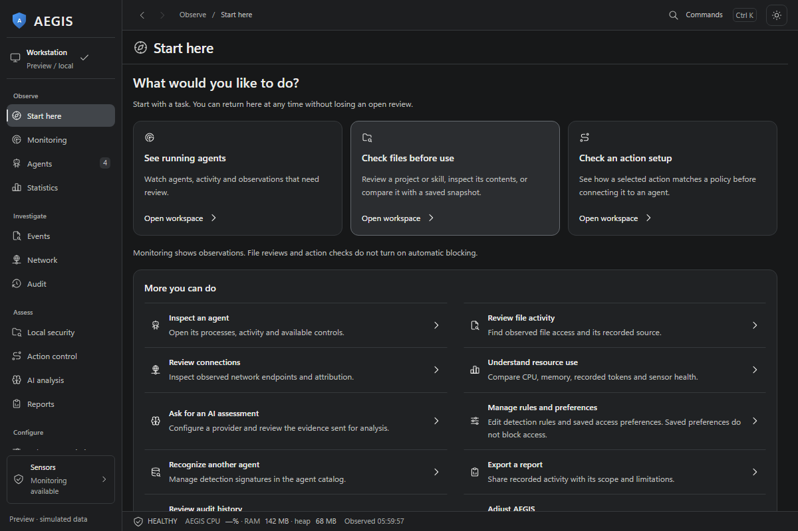

<div align="center">
  <h1>AEGIS</h1>
  <p><b>Local monitoring and action review for AI agents</b></p>
</div>

AEGIS helps you see what local AI agents are doing, review agent files before use,
and check policies for selected actions. Monitoring records processes, file
activity, TCP endpoints and attribution evidence without requiring an agent plugin.

Current source also includes opt-in policy-controlled execution and MCP tools for
operator-selected actions. These routes require explicit setup; ordinary agent
monitoring does not automatically intercept or block commands.

**Open-source, monitor-first, no usage telemetry or cloud sync.** Monitoring data is stored locally. Endpoint naming uses DNS queries. Optional AI analysis sends activity metadata to Anthropic on request; update checks contact GitHub. See [privacy and key handling](SECURITY.md#privacy-architecture).

<p align="center">
  <a href="https://github.com/antropos17/Aegis/releases"></a>
  
  <a href="#monitor-first"></a>
  
  
</p>

[Download](#download) · [Start with a task](#start-with-a-task) · [Documentation](docs/README.md) · [Local demo](#try-without-ai-agents) · [Known limits](#known-limits) · [Report a bug](https://github.com/antropos17/Aegis/issues/new?template=01-bug-report.yml)

## Start with a task

| What you want to do | Where to start |
| --- | --- |
| See running agents and review their activity | **Monitoring**, then an agent's processes, files or connections |
| Check a project, skill or agent profile before use | [**Local security**](docs/LOCAL-SECURITY-UI.md): static review, inventory, comparison and offline report import |
| Check how a selected action matches a policy | [**Action control**](docs/ACTION-COVERAGE-UI.md): choose files and review the captured outcome |
| Connect selected actions to an agent | [MCP setup](docs/ACTION-MCP-CONFIG.md), explicitly configured from a terminal |
| Explore settings, reports and the other tools | **Start here** in the sidebar, or **Commands** (`Ctrl K`) |

The [guided interface](docs/OBSERVATORY-GUIDED-WORKFLOWS.md) keeps results above
setup, uses distinct icons for each workspace and reveals technical details on
request. File and action checks do not execute commands or establish safety.
This describes current source; the published installer can contain an earlier UI.

<details>
<summary>Current interface preview</summary>



Current source preview with simulated data, captured 19 September 2026.

</details>

## What AEGIS observes

| Layer | Coverage |
| --- | --- |
| Processes | 112 agents (265 process-name signatures), parent-chain and IDE-host detection, with limited WSL and IDE-extension discovery |
| Files | Changes in configured sensitive directories and agent config paths; Windows open-handle and Restart Manager observations |
| Network | TCP endpoints for detected agent PIDs, forward-confirmed reverse DNS, and `allowlisted` / `unknown` / `flagged` verdicts |
| Behavior | 73 sensitive-path detection rules across 8 categories, rolling 10-session baselines, anomaly scoring and sequence correlations |
| Local LLMs | Ollama and LM Studio runtime probes; other supported runtimes detected by process signature |

The Observatory workspace provides a live instance radar, separate agent instances, file and network views, rules, custom agent catalog, AI analysis, reports, audit, statistics and settings. Activity can be filtered and grouped, inspected by stamped instance identity, and exported to JSON, CSV, HTML or ZIP. The [agent database](src/shared/agent-database.json) and [contributor guide](CONTRIBUTING.md#how-to-add-a-new-agent) describe how to extend detection.

## Monitor-first

Default monitoring observes and logs; it does not automatically block or contain agents. Kill, suspend and resume are manual actions. Monitoring presets and endpoint allowlists do not establish that an agent is safe. The opt-in routes below control only selected launches. The Windows Job route bounds the lifetime of its participating descendants; none of these routes restricts file or network access.

AEGIS is alpha software. This README describes current source; installed builds contain the features available at their [release tag](https://github.com/antropos17/Aegis/releases).

## Opt-in action control

An operator can select an exact executable, working directory, arguments and
environment, then route that action through AEGIS:

| Capability | Implemented scope |
| --- | --- |
| [Exact execution policy](docs/ACTION-EXECUTION.md) | Explicit CLI launch on `allow`; `ask`, `deny` and preparation failures do not launch |
| [Windows Job lifetime route](docs/ACTION-EXECUTION.md#opt-in-windows-job-lifetime-route) | An approved selected Windows action starts inside a private Job; confirmed cleanup ends ordinary Job-member descendants. External brokers and actions outside this route remain outside its control |
| [Terminal confirmation](docs/ACTION-CONFIRMATION.md) | Review the complete effective action and confirm one launch attempt; policy deny cannot be overridden |
| [Selected-action MCP catalog](docs/ACTION-MCP-CATALOG.md) | Up to eight operator-selected actions with empty tool arguments; optional [terminal review broker](docs/ACTION-MCP-REVIEW.md) requires fresh confirmation per eligible call |
| [Route and catalog checks](docs/ACTION-ROUTE-CHECK.md) | Inspect selected configuration and current-process prerequisites without executing; a completed check grants no permission |
| [MCP connection status](docs/ACTION-MCP-STATUS.md) | Read-only counters for the current connection's admitted calls, pending work and cancellation requests |
| [Action control workspace](docs/ACTION-COVERAGE-UI.md) | Native file selection and nonexecuting route/catalog checks in Observatory; shows captured policy outcomes, explicit unverified coverage and a configuration-check link when setup is missing |
| [Live route observation](docs/ACTION-LIVE-OBSERVATION.md) | Opt-in desktop observation of one running MCP owner; self-reported client metadata, bounded counters and coverage loss; blocking and provider identity remain unverified |

These routes do not cover other agent tools, arbitrary MCP traffic or activity
outside the selected actions. Allowed programs retain the caller's account
privileges. Terminal previews can expose secrets in local scrollback; terminal
automation does not establish human identity. Client settings are not changed
automatically. The linked contracts explain configuration, limits and verification.

After creating a catalog, generate a client configuration from the source checkout
(PowerShell 7 example):

```powershell
node src/main/main.js --action-mcp-config-json catalog "X:/private/actions/catalog.json" > aegis-mcp.json
```

The [configuration generator](docs/ACTION-MCP-CONFIG.md) prints an
`mcpServers.aegis` entry using the current Node executable and absolute source
entry path. Load the generated file explicitly in a client that accepts this
configuration format; client setup requirements vary. The output intentionally
contains local paths, so keep it private. Generation does not read or validate the
catalog, start a server or install settings; run the appropriate route/catalog
check separately.

## Download

### Windows installer

The latest published prerelease checked on 26 September 2026 is
[0.16.0-alpha](https://github.com/antropos17/Aegis/releases/tag/aegis-v0.16.0-alpha).
Its Windows `.exe`, `manifest.json` and `manifest.json.sig` are published together;
follow [offline installer verification](docs/RELEASE-VERIFICATION.md) after download.
The release includes signed Windows update support; when upgrading from
0.14.1-alpha or older, install 0.15.0-alpha or newer manually first. Source
changes merged after the 0.16.0-alpha tag, including the Windows Job lifetime
route, are not in that installer.

### From source

Requires **Node.js 24.x**. Windows 10/11 is the primary platform; macOS/Linux support is experimental.

```bash
git clone https://github.com/antropos17/Aegis.git
cd Aegis
npm ci
npm start
```

### Try without AI agents

After installing dependencies, build and preview the browser demo:

```bash
npm run dev
# open http://127.0.0.1:8770
```

The preview uses simulated data and an isolated host. It shares the desktop components, never calls the real preload, and disables native exports and provider requests. `npm run frontend:build:preview` creates a static preview; `npm run build:renderer` creates the desktop artifact without fixtures.

<details>
<summary>Release history</summary>

| Version | Date | Highlights |
|---------|------|------------|
| [v0.16.0-alpha](https://github.com/antropos17/Aegis/releases/tag/aegis-v0.16.0-alpha) | 2026-09-26 | Windows setup wizard, monitoring performance work, scoped local security inventory, direct selected-action and MCP routes |
| [v0.15.0-alpha](https://github.com/antropos17/Aegis/releases/tag/aegis-v0.15.0-alpha) | 2026-09-12 | Observatory desktop, signed Windows updates, Linux process-generation identity and bounded ETW diagnostics |
| [v0.14.1-alpha](https://github.com/antropos17/Aegis/releases/tag/aegis-v0.14.1-alpha) | 2026-09-07 | Evidence-file watchers moved off the main thread; dependency maintenance |
| [v0.14.0-alpha](https://github.com/antropos17/Aegis/releases/tag/aegis-v0.14.0-alpha) | 2026-09-07 | Sequence rules, observation-gap records, audit indexing and sensor-health work |
| [v0.13.0-alpha](https://github.com/antropos17/Aegis/releases/tag/aegis-v0.13.0-alpha) | 2026-08-23 | Signed release manifests for offline installer verification |
| [v0.12.0-alpha](https://github.com/antropos17/Aegis/releases/tag/aegis-v0.12.0-alpha) | 2026-08-22 | Monitoring and renderer updates; see release notes |
| [v0.11.0-alpha](https://github.com/antropos17/Aegis/releases/tag/aegis-v0.11.0-alpha) | 2026-08-11 | Windows installer, Event Schema v1 attribution, endpoint verdicts, sensor health records, WSL & IDE-extension detection |
| [v0.10.0-alpha](https://github.com/antropos17/Aegis/releases/tag/aegis-v0.10.0-alpha) | 2026-03-09 | Code cleanup, security hardening, command palette |
| [v0.9.1-alpha](https://github.com/antropos17/Aegis/releases/tag/aegis-v0.9.1-alpha) | 2026-03-09 | Dropdown dedup, skill paths, aegis-context optimized |
| [v0.9.0-alpha](https://github.com/antropos17/Aegis/releases/tag/aegis-v0.9.0-alpha) | 2026-03-08 | categoryIndex, prompt-craft skill, TS migration stores |
| [v0.8.2-alpha](https://github.com/antropos17/Aegis/releases/tag/aegis-v0.8.2-alpha) | 2026-03-08 | formatBytes TS extraction, meaningful tests, branch cleanup |
| [v0.8.1-alpha](https://github.com/antropos17/Aegis/releases/tag/aegis-v0.8.1-alpha) | 2026-03-08 | Patch release |
| [v0.8.0-alpha](https://github.com/antropos17/Aegis/releases/tag/aegis-v0.8.0-alpha) | 2026-03-05 | Launch readiness: CSP hardened, OpenClaw integration, README overhaul |
| [v0.7.0-alpha](https://github.com/antropos17/Aegis/releases/tag/aegis-v0.7.0-alpha) | 2026-03-04 | YAML rulesets, 68 rules, hot-reload, 568 tests |
| [v0.5.0-alpha](https://github.com/antropos17/Aegis/releases/tag/aegis-v0.5.0-alpha) | 2026-03-03 | Fancy UI redesign, VisTimeline, AgentGraph |
| [v0.4.0-alpha](https://github.com/antropos17/Aegis/releases/tag/aegis-v0.4.0-alpha) | 2026-03-03 | TypeScript infrastructure, perf, refactoring |

</details>

## The evidence graph

The **Local security** workspace reviews selected project/profile files, commands,
scripts and instruction patterns, compares content snapshots, and imports offline
Cisco results. It keeps incomplete coverage and unverified claims visible. See the
[workspace guide](docs/LOCAL-SECURITY-UI.md) for inputs, evidence and limitations.

- **Instance identity:** Windows uses PID and OS birth time; Linux uses boot identity and kernel process start ticks. Missing witnesses and synthetic discoveries provide weaker identity.
- **Attribution:** Records distinguish confirmed, inferred and unattributed ownership. Identity or attribution can be null when unknown or not applicable.
- **Audit trail:** Hash-chained JSONL records rotate daily and have 30-day retention. Chain verification detects edits relative to a trusted chain state; it does not guarantee that no events were lost.

See the [architecture](ARCHITECTURE.md), [correctness audit](docs/current-state/CORRECTNESS-AUDIT.md) and [dated measurements](docs/bench/) for implementation details and evidence.

## Known limits

- **Incomplete coverage:** Unknown signatures and processes that start and exit between polling ticks can be missed. Default monitoring does not parse MCP traffic or individual tool calls; the explicitly configured MCP routes handle only their published AEGIS tools.
- **Platform gaps:** macOS lacks a process-generation witness. Linux generation identity depends on accessible `/proc` data; its fallback has no start-time witness. Missing identity limits process-control guarantees. Measured Claude Code usage requires a process start-time witness and a readable matching session registry/transcript. Windows is the verified primary path; native Linux token collection remains unverified.
- **Bounded UI history:** Retained event windows can differ from aggregate totals; Statistics shows renderer eviction counters; Audit provides persisted history.
- **Sensor and audit gaps:** Health status does not prove complete capture. A fully lost file-watch plan gets up to three retry attempts per confirmed outage; the budget resets after a healthy plan is observed. Exited watch workers count as lost roots. Partially degraded roots need separate repair. Audit loss markers require a successful flush; process-scan overruns lack a dedicated counter.
- **Sensitive metadata:** Logs and exports contain paths, agent names and endpoints. Configuration and diagnostic exports omit the configured API key. Local key encryption depends on safeStorage availability. See [SECURITY.md](SECURITY.md).
- **Unmeasured claims:** No general detection rate, false-positive rate, startup-time guarantee or whole-app overhead figure has been established.

## Development and roadmap

Inspect a project's AI component files without starting agents or MCP servers:

```powershell
node src/main/main.js --inventory-json "X:/path/to/project"
node src/main/main.js --inventory-profile-json codex-user "X:/copied-codex-profile"
```

This produces a bounded local inventory with fingerprints, not a security
verdict. See [scope, privacy and exit codes](docs/PROJECT-INVENTORY.md) and the
[AI agent protection plan](docs/roadmap/ai-agent-protection.md).

The monitoring engine uses CommonJS JavaScript; the Svelte renderer and shared types use TypeScript. See [development setup](CONTRIBUTING.md), the [development reference](docs/DEVELOPMENT.md) and [package.json](package.json) for the stack and commands.

CI runs build, lint, type checks, tests and dependency auditing. `npm run counts:check` verifies selected inventory declarations. `npm run verify:gate` checks identity-witness behavior with fault injection (4 mutants); `npm run verify:seq-gate` checks sequence behavior. Run `npm test` for current suite results.

The [roadmap](ROADMAP.md) tracks Windows ETW experiments and remaining discovery/platform work. Source changes and isolated experiments are not automatically available in released installers.

## Contributors

<table>
  <tr>
    <td align="center"><a href="https://github.com/antropos17"><br/><sub><b>Antropos7</b></sub></a></td>
    <td align="center"><a href="https://github.com/travisbreaks"><br/><sub><b>travisbreaks</b></sub></a></td>
    <td align="center"><a href="https://github.com/MsfPablo"><br/><sub><b>MsfPablo</b></sub></a></td>
    <td align="center"><a href="https://github.com/raye-deng"><br/><sub><b>raye-deng</b></sub></a></td>
    <td align="center"><a href="https://github.com/pablo"><br/><sub><b>pablo</b></sub></a></td>
  </tr>
  <tr>
    <td align="center"><a href="https://github.com/skmelendez"><br/><sub><b>Steven Melendez</b></sub></a></td>
    <td align="center"><a href="https://github.com/anupamme"><br/><sub><b>anupamme</b></sub></a></td>
    <td align="center"><a href="https://github.com/mig-builds"><br/><sub><b>mig-builds</b></sub></a></td>
    <td align="center"><a href="https://github.com/frobel0520"><br/><sub><b>frobel0520</b></sub></a></td>
    <td align="center"><a href="https://github.com/KJyang-0114"><br/><sub><b>KJyang-0114</b></sub></a></td>
  </tr>
</table>

[CONTRIBUTING.md](CONTRIBUTING.md) &middot; [SECURITY.md](SECURITY.md) &middot; [CODE_OF_CONDUCT.md](CODE_OF_CONDUCT.md)

## Support and license

[Feature requests](https://github.com/antropos17/Aegis/issues/new?template=02-feature-request.yml) · [Private vulnerability reports](https://github.com/antropos17/Aegis/security/advisories/new) · [MIT license](LICENSE)

Local monitoring requires no account or subscription. Optional Anthropic analysis uses your own API key and is subject to that service's charges.

Navigation icons use a curated [Tabler Icons](https://github.com/tabler/tabler-icons)
subset under the [MIT notice](frontend/observatory/vendor/tabler-icons.LICENSE).
Pinned source URLs and hashes are recorded in the [icon provenance](frontend/observatory/vendor/tabler-icons.provenance.json).

## Star history

[](https://www.star-history.com/?repos=antropos17%2FAegis&type=timeline&legend=top-left)
