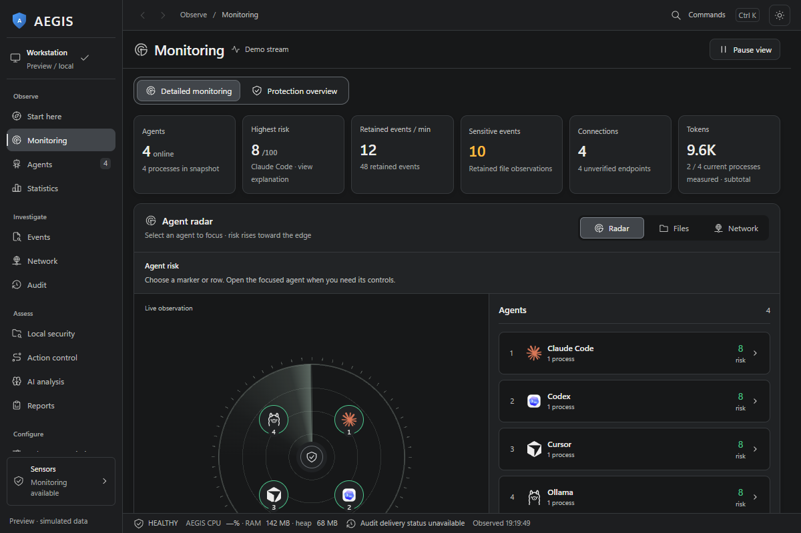
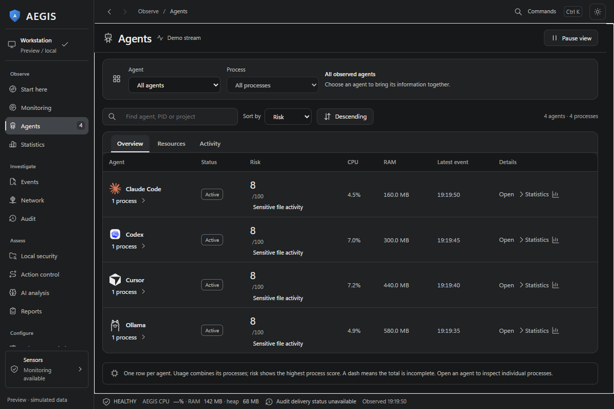
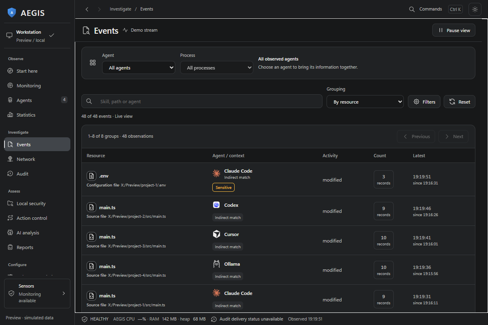
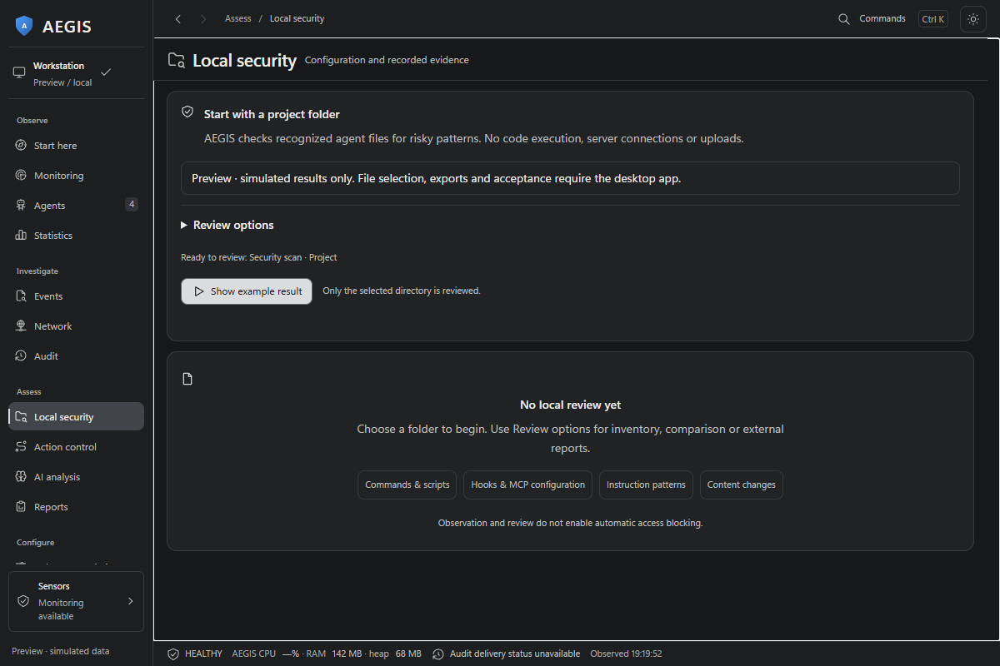
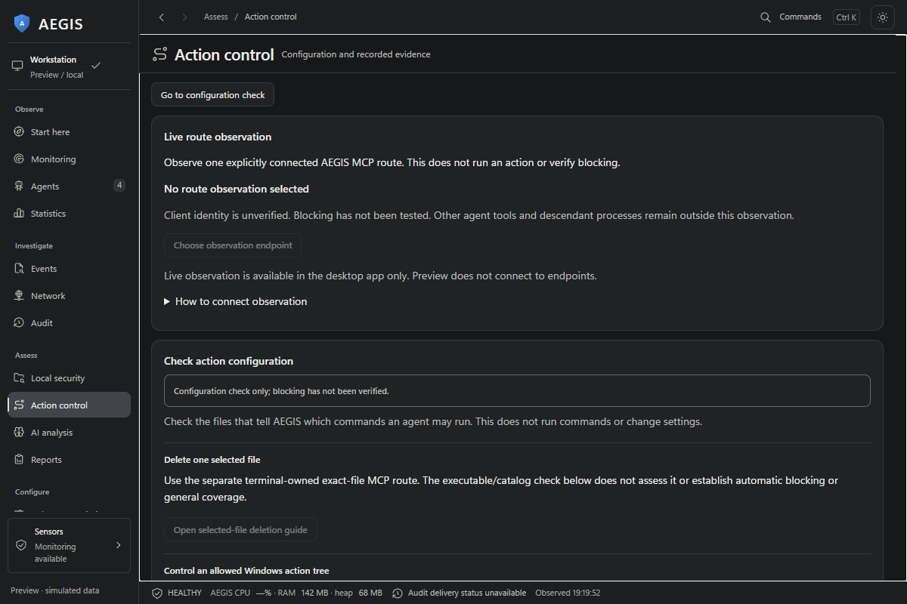
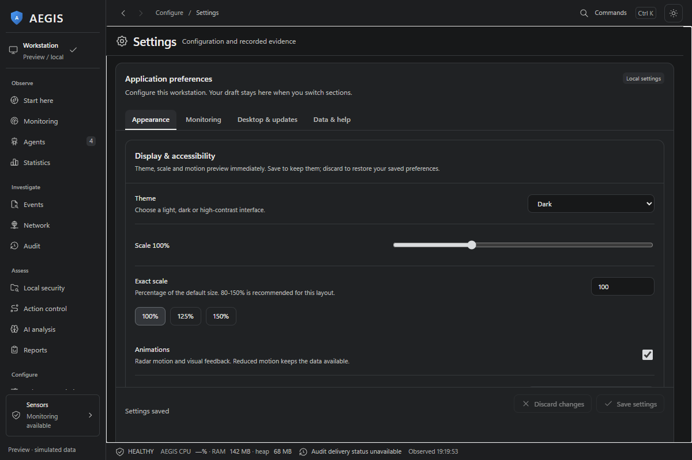

# Observatory screenshots

Captured from the 0.17.0-alpha source preview on 27 September 2026 with simulated data. They show the interface and do not demonstrate live detection, an installed release, or automatic blocking.

| Observe | Investigate |
| --- | --- |
|  |  |
|  |  |
|  |  |

The [Start here guide](../images/observatory-guide.png) is also captured from the same preview. To recapture these files and the [social preview](../social-preview.png) from the current source, run `node scripts/capture-screenshots.mjs` after `npm ci`.
